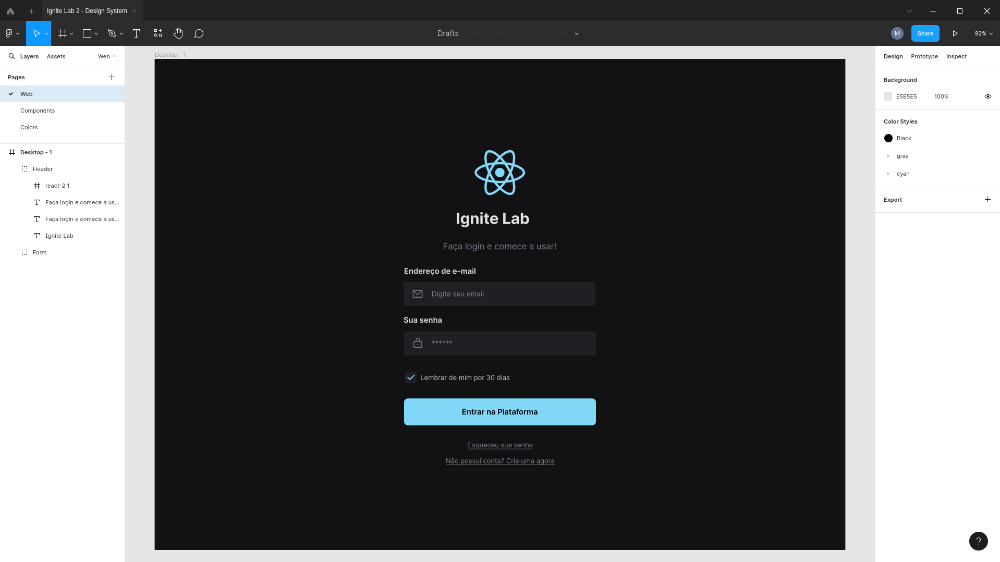
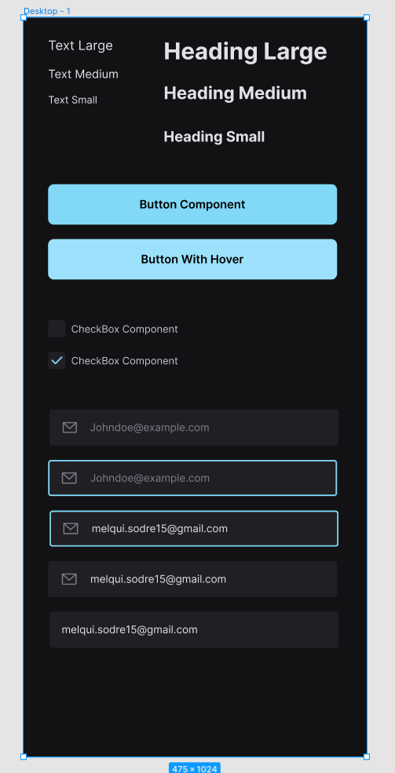
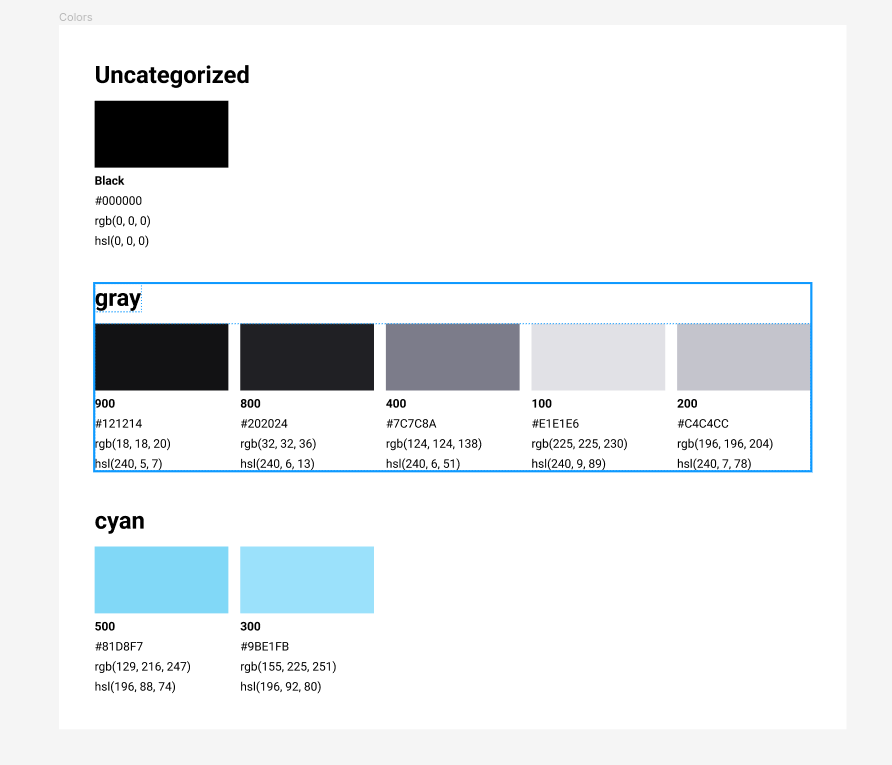

<div align="center">
  
</div>
<br>

# IgniteLab | ReactJS
Terceira edição do IgniteLAB, um evento com foco total em front-end, utilizando as ferramentas mais atuais.<br>
Nesta edição, será construido um Design System do Figma ao React de um projeto front-end. Serão utilizadas algumas ferramentas como: Storybook, radix, tailwindcss e diversas outras ferramentas do ecossistema REACTJS.
<br>

- Ferramentas utilizadas
  - Figma
    - PhosporIcon
    - Color Styleguide
  - ReactJS
    - Vitejs
    - Tailwindcss
    - Postcss
    - StoryBook
    - Clsx
    - Radix
      - Slot
      - Checkbox

## Aprendizados:

### Design System
Design System corresponde à um documento vivo com todos os componentes e propriedades para facilitar a integração entre os times de desenvolvimento (ux/ui e desenvolvedores). Ao ser adotada esta convenção, os projetos irão seguir uma mesma linha visual, porém, o Desing System vai muito mais além do que apenas a criação de padrões de cor e tipografia.

### StoryBook
Ferramenta de visualização de componentes de forma isolada. <br>

### ArgTypes
Possibilita flexibilidade de alterar diretamente pela interface do storybook algumas props passadas para o componente.

### Tokens no tailwind
É possível extender propriedades default do tailwind, como no caso de incorporar uma nova fontFamily. Mas também é possível alterar algumas propriedades default do tailwind para algo muito mais personalizado do projeto.

```js
// Extendendo
 theme: {
    extend: {
      // Definindo a fonte "padrão"
      fontFamily: {
        sans: 'Inter, sans-serif'
      },
    },
  },
```

```js
// Alterando os padrões
  theme: {
    fontSize: {
      xs: 14,
      sm: 16,
      md: 18,
      lg: 20,
      xl: 24,
      '2xl': 32,
    },
    colors: {
      black: '#000000',
      white: '#ffffff',

      transparent: 'transparent',

      gray: {
        900: '#121214',
        800: '#202024',
        400: '#7C7C8A',
        200: '#C4C4CC',
        100: '#E1E1E6',
      },
      
      cyan: {
        500: '#81D8F7',
        300: '#9BE1FB'
      }
    },
  }
```
### CLSX
Permite a criação de "classes" usando o tailwind, podendo assim, criar condições de estilização personalizada para um mesmo componente.
```js
// Utilizando condições com clsx
    return(
        <Component 
            className={clsx(
                // Definições padrões
                'text-gray-100 font-sans',
                {
                    // Aplicar o texto xs caso o text do component for definido com o sm
                    'text-xs': size === 'sm',
                    'text-sm': size === 'md',
                    'text-md': size === 'lg',
                }
            )}
        >
            {children}
        </Component>
```

### Radix React-Slot
Com esta bibliteoca será habilitado uma flexibilidade, para os devs, de alterar as tipagens das tags de componentes

### LoginPage
<div align="center">
  
</div>
<br>
<hr>

### Components
<div align="center">
  
</div>
<br>
<hr>

### Color patterns
<div align="center">
  
</div>
<br>
<hr>
